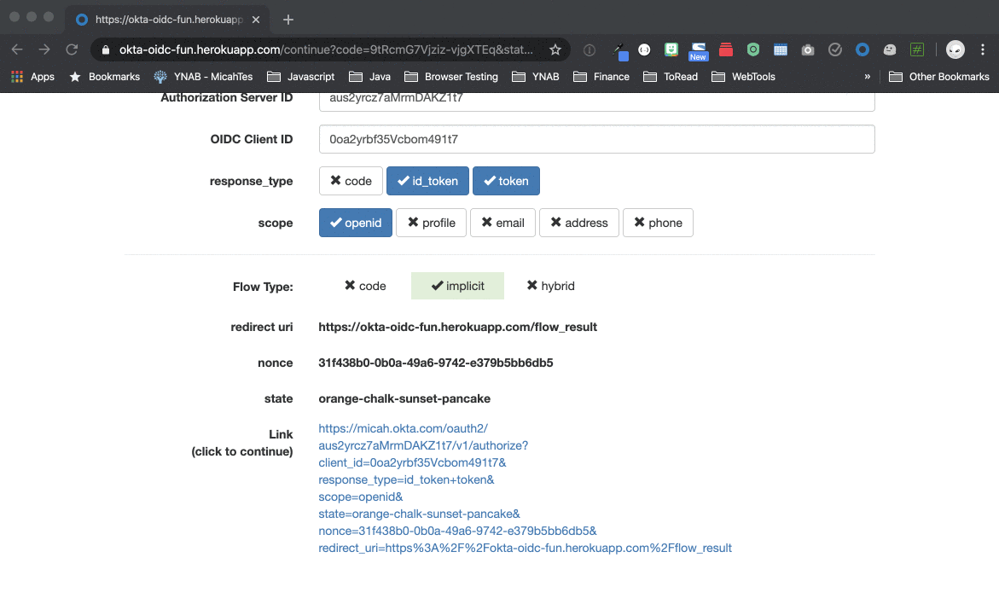

## Implicit Flow Detector

This browser extension detects websites that use the implicit flow. It does this by scanning urls and looking for `id_token` and/or `access_token` in the url.

It works on both Firefox and Chrome. It should work on chromium variants. It doesn't work on Safari.

If the implicit flow is detected, the site url will be added to a tree view in the extension popup. Expanding that tree shows you the token contents. It also shows a yellow indicator for the presence of an id token and a red indicator for the presence of an access token.

The code is vanilla javascript. There is one dependency: `browser-polyfill.js`, which makes chrome adhere to the standard for browser extensions that mozilla has proposed. This enables it to be a single codebase that works in both chrome and firefox.

### Run locally

Install `web-ext` with:

```
npm install --global web-ext
```

Launch firefox and chrome to test:

```
web-ext run -t chromium -t firefox-desktop
```

### Install in Browsers

The extension will soon be available as a beta on [Firefox Add-Ons](https://addons.mozilla.org) and in the [Google Chrome web store](https://chrome.google.com/webstore/category/extensions).

For now, you can install it locally by following these instructions:

#### Firefox

Click the hamburger menu in the upper right. Select **Add-ons**. Click the gear icon. Select **Debug Add-ons**. Click **Load Temporary Add-on...**. Select the **implicit-flow-detector-0.1.zip** file.

#### Chrome

Click the vertical three dots in the upper right. Select **More tools > Extensions**. Click the **Developer mode** slider mode in the upper right. Click the **Load unpacked** button. Select the folder this README is in.

### See it in Action

1. The icon for the extension is a green hash symbol. Navigate to: [https://okta-oidc-fun.herokuapp.com](https://okta-oidc-fun.herokuapp.com)
2. Uncheck **code** and check **id token** and **access token**
3. Click the link the at the bottom of the page
4. Notice that the extension icon changes from green to red to indicate that an implicit flow has been detected
5. Click the red hash icon and you'll see `https://okta-oidc-fun.herokuapp.com` in the list



Bonus:

You can see additional sites added to the implicit flow detector by going to: [OAuth.com Implicit Flow playground](https://www.oauth.com/playground/implicit.html) and/or [Medium post on Implicit Flow](https://medium.com/@nilasini/real-world-example-to-understand-oidc-implicit-flow-ecdf1b1d0156). 

**NOTE**: If you do the medium.com example, you'll see that they use an opaque access token and a JWT ID Token. The browser add-on represents these accordingly. It *should* work with any site that uses the implicit flow.

### Good sites for testing

The following urls use the implicit flow and will result information showing in the browser extension:

* https://okta-oidc-fun.herokuapp.com
    * make sure **access token** and/or **id token** are checked
* https://www.oauth.com/playground/implicit.html
* https://medium.com/@nilasini/real-world-example-to-understand-oidc-implicit-flow-ecdf1b1d0156
    * login with google

### Next Steps

* cleanup iconography and style
* ~~show the raw tokens in popup~~
* ~~show "yellow alert" icon if *only* id token is detected~~
* ~~show "red alert" icons if access token is detected~~
* ~~if token(s) are jwts, show claims~~
* ~~pretty print claims if present~~
